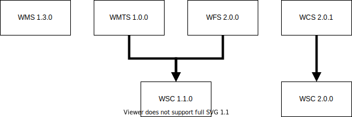

# ogc-specifications
[](https://github.com/PDOK/ogc-specifications/actions/workflows/lint.yml)

[](https://github.com/PDOK/ogc-specifications/releases)
[](https://goreportcard.com/report/PDOK/ogc-specifications)

The package ogc-specifications is a implementation of the OGC Web Service
Specifications as defined by the [OGC](https://www.ogc.org/). This package has
support for the following OGC Web Service Specifications Operations:

| Spec | Version | Operation | Request | Response |
| --- | --- | --- | --- | --- |
| WMS | 1.3.0 | GetCapabilities | :heavy_check_mark:  | :grey_exclamation: |
| WMS | 1.3.0 | GetMap | :heavy_check_mark: | |
| WMS | 1.3.0 | GetFeatureInfo | :heavy_check_mark: | |
| WFS | 2.0.0 | GetCapabilities | :heavy_check_mark: | :grey_exclamation: |
| WFS | 2.0.0 | DescribeFeatureType | :heavy_check_mark: | |
| WFS | 2.0.0 | GetFeature | :heavy_check_mark: | |
| WMTS | 1.0.0 | GetCapabilities | :heavy_check_mark: | :grey_exclamation: |
| WCS | 2.0.1 | GetCapabilities | :heavy_check_mark: | :grey_exclamation: |

## Purpose

It will provide the user with OperationRequest, Capabilities (and limited to
GetCapabilities OperationResponse) structs for the different OGC specifications
that can be used with in a developers application, so one doesn't needs to
create/build those complex structs for 'every' application that has more then
'simple' interaction with a OGC Web Service. It will allow the developer to
parse XML documents and query strings like they are defined in the OGC
specification an build go structs with it and it will generate XML documents and
KVP query strings based on those structs.

The different packages follow the same relations that are defined in the OGC
specifications. For example the WFS 2.0.0 and the WMTS 1.0.0 share the underling
WSC 1.1.0 package.

### OGC package relations



## Notice

:warning: This is still a 'work-in-progress' with the following major to do's:

- [ ] WFS StoredQuery support
- [ ] WMTS GetTile support
- [ ] WCS GetCoverage support
- [ ] OGC response support for metadata calls like GetCapabilities and
  DescribeFeatureType
- [ ] Sufficient validation support
- [ ] Cleanup YAML parser
- [ ] WMS Time & Elevation parameters

## Installation

```go
go get github.com/pdok/ogc-specifications
```

import a specific ogc specification like wms of wfs.

```import
import wms "github.com/pdok/ogc-specifications/pkg/wms"
import wfs "github.com/pdok/ogc-specifications/pkg/wfs"
```

## Test

```go
go test ./... -covermode=atomic
```

And for benchmarks:

```go
go test -bench=. ./...
```

And generate CPU & MEM profiles:

```go
go test -cpuprofile cpu.prof -memprofile mem.prof -bench=.  ./...
```

For visualization use [pprof](https://github.com/google/pprof)

## Usage

- [Simple BBOX](./examples/simple-bbox/main.go)
- [Exceptionreports](./examples/exceptionsreports/main.go)

## Concept


THe idea is that OGC Webservice requests, both GET and POST, can be deserialize
to `structs`. Because the POST request contain a XML body they can be
directly unmarshelled to the 'matching' `struct`. The GET request have a number
of predefined Key Value Pairs (KVP) in their querystring that need to be
consumed for building the `struct`.

From the created struct one can:

1. Validate the struct itself (**grammatically**)
1. Validate the struct against a Capabilities document (**context**)
1. Generate a new request object (**formatting**)

## How to Contribute

Make a pull request...

## License

Distributed under MIT License, please see license file within the code for more
details.
